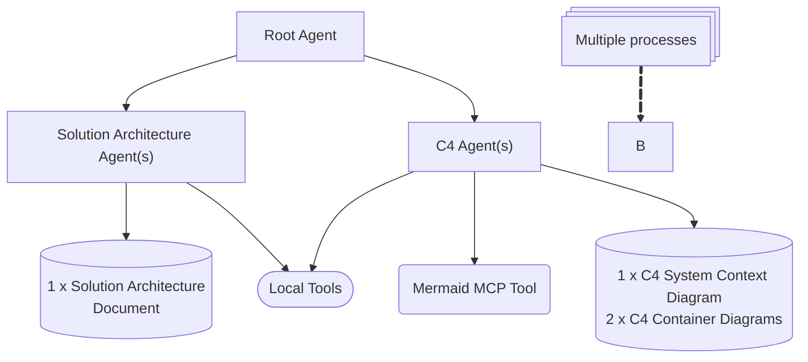

# "Keep My Job" App

**Are you struggling to keep your job?** Want to impress your boss and appear marginally more competent?
You are in the right place!

**Keep My Job** app is an AI multi-agent system that helps you work faster and get more done—without staring at a blank
architecture diagram for hours.

Given a problem statement, the agents collaborate to propose an optimal solution architecture and automatically generate
C4 system context and container diagrams.

## Demo

Watch this 2-minute demo of the app in action.

[](https://www.youtube.com/watch?v=Toh2HwAzqHc "Agentic AI with Google ADK")

## 10,000-Foot Architecture



## 5,000-Foot Architecture


## Getting Started

### STEP 1: INSTALL PYTHON DEPENDENCIES

```shell
cd python/
pip install -r requirements.txt
```

### STEP 2: SETUP MODEL

#### Using Gemini in Vertex AI

- Log in to Google Cloud:

```shell
gcloud auth login && gcloud auth application-default login
```

- Create an .env file.

```shell
cp adk/.env.gemini.sample adk/.env

# replace `[PROJECT_ID]` in .env with your GCP project ID.
```

#### Using Ollama-Hosted Local Model

- Install and restart Ollama service:

```shell
brew install ollama
brew services restart ollama
```

- Pull a local model:

```shell
ollama pull qwen3:8b
```

- Create an .env file.

```shell
cp adk/.env.ollama.sample adk/.env

# Update MODEL in .env accordingly
```

### STEP 3: RUN THE BAD BOY

- Run the web UI.

```shell
cd python/adk/
adk web
```

- Navigate to http://127.0.0.1:8000 and run the agent.

### STEP 4: ????

- ...

### STEP 5: PROFIT!


